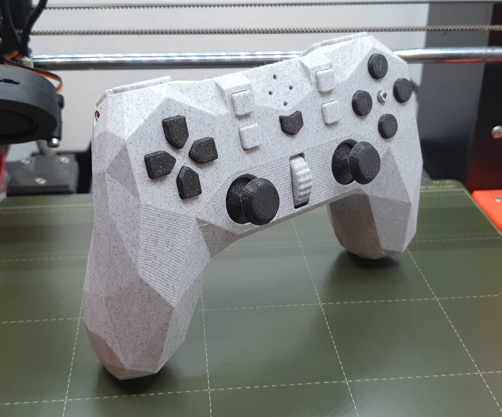

# Vikkuna

Hackable controller based on the amazing [Alpakka by Input Labs](https://inputlabs.io/alpakka)

## Releases

Check [the releases page](https://github.com/gkr-labs/vikkuna/releases)

## Lineage

This is a fork of the original (v0) Alpakka with a few modifications to satisfy my household's gaming needs

Its maintained as the smallest possible set of patches atop the Alpakka project

Changes include:

- USB-C

- Additional thumbstick

- Simpler touch surface

- Different shape and or position of buttons, thumbsticks, triggers and case

The latest iteration (v1) of the Alpakka removes the need for most of these changes and has a multitude of worthwhile new features

Please support the official release

## Components

- [Firmware](https://github.com/gkr-labs/vikkuna_firmware)

- [PCB](https://github.com/gkr-labs/vikkuna_pcb)

- [Case](https://github.com/gkr-labs/vikkuna_case)

- [Ctrl app](https://github.com/gkr-labs/ctrl)

## Attribution

- [Input Labs](https://inputlabs.io) for the incredible work on the [Alpakka](https://inputlabs.io/alpakka)

- [KawaiiLongmao](https://github.com/KawaiiLongmao) for reworking the electronics to fit a RP2040-Zero, which is the basis for the [PCB](https://github.com/gkr-labs/vikkuna_pcb) changes

## Licenses

`Firmware` and `Ctrl app` are released under the `GNU GENERAL PUBLIC LICENSE Version 2`

`PCB` and `Case` are released under the `Creative Commons BY-NC-SA 4.0`

Check each repository for details
